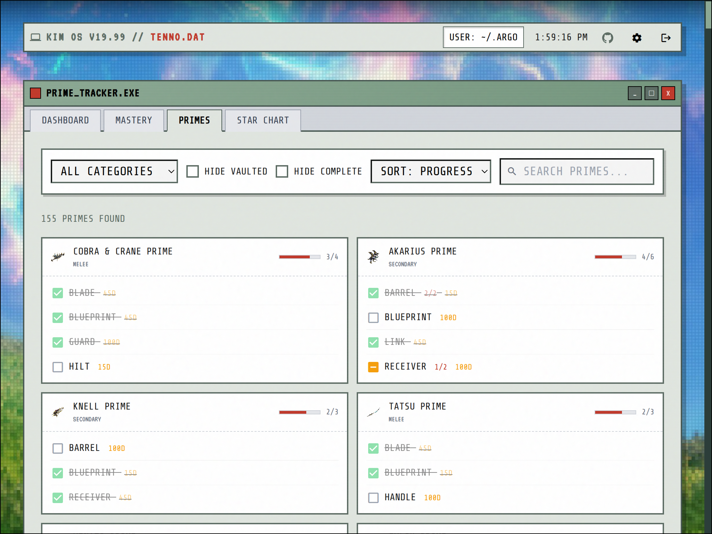

# TENNO.DAT

> KIM OS v19.99 // TENNO.DAT

A 1999-themed Warframe mastery tracker. Sync your profile from DE, track mastery progress across 15+ categories, view loadout and weapon stats, plan your grind with wishlists.

## Screenshots


*Dashboard - mastery rank, intrinsics, loadout, and category progress*


*Mastery list - search, filter by category/state, toggle Primes, wishlist items*


*Prime parts list - track ownership of Prime parts and plan your farm*


## Features

- **Steam Login** - Secure authentication, no password storage
- **Profile Sync** - Mastery XP, weapon stats, loadout, intrinsics, star chart from DE's public API
- **MR Calculator** - Accurate calculation including equipment, intrinsics (90 levels), star chart, legendary ranks
- **Category Tracking** - 15+ categories (frames, weapons, companions, necramechs, kitguns, zaws, amps)
- **Prime Tracker** - Track ownership of Prime parts per component, with multi-quantity support and relic drop info
- **Weapon Statistics** - Kills, accuracy, equip time synced from profile
- **Wishlist** - Mark items to track, sorted to top
- **Star Chart Progress** - Track completions including Steel Path

## Tech Stack

**Frontend**: SvelteKit 2, Svelte 5, Bootstrap 5
**Backend**: Hono, hexagonal architecture
**Database**: PostgreSQL, Drizzle ORM
**Data**: [@wfcd/items](https://github.com/WFCD/warframe-items)

## Setup

```bash
pnpm install
docker compose up -d          # Postgres on port 5433
pnpm db:migrate && pnpm db:seed
pnpm dev                      # API: 3000, Web: 5173
```

### Environment Variables

```env
STEAM_API_KEY=your_key        # Optional, for Steam profile fetching
BASE_URL=http://localhost:3000
FRONTEND_URL=http://localhost:5173
```

### First Sync

1. Login with Steam
2. **Settings** → Enter Warframe Account ID + platform
3. **Dashboard** → **Sync Profile**

**Finding Account ID**: Check `%LOCALAPPDATA%\Warframe\EE.log` or use [Tenno Tracker](https://github.com/Jelosus2/TennoTracker) extension.
**Profile must be PUBLIC** in Warframe settings.

## Testing

```bash
pnpm test                     # Unit tests (Vitest)
cd packages/web && pnpm test:e2e              # Visual regression (Playwright)
pnpm test:e2e:update-snapshots                # Update baselines after CSS changes
```

## License

MIT
