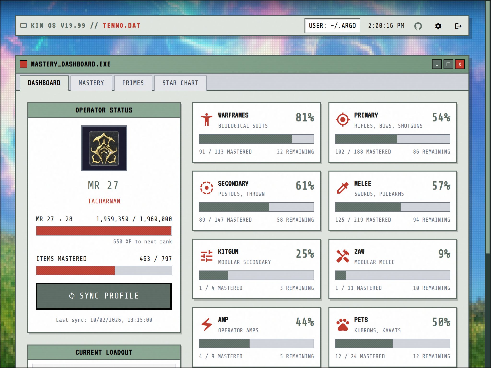
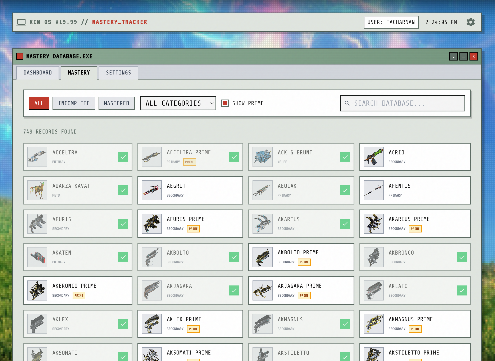

# TENNO.DAT

> KIM OS v19.99 // TENNO.DAT

A retro-themed Warframe mastery tracker with a Windows 95/98 aesthetic. Track your mastery progress, view your loadout, and see what items you still need to master.

## Screenshots


*Dashboard with operator status, mastery progress by category, and current loadout*


*Mastery list with filtering, search, and Prime toggle*

## Features

- **Profile Sync** - Pulls mastery data from DE's public profile API
- **Mastery Tracking** - See progress by category with filtering
- **Loadout Display** - View your current equipped items and focus school
- **Prime Filter** - Toggle Prime items visibility
- **Item Details** - Click any item for detailed information

## Tech Stack

| Layer | Technology |
|-------|------------|
| Frontend | SvelteKit 2 + Svelte 5 |
| Styling | Bootstrap 5 + SASS |
| Backend | Hono (TypeScript) |
| Database | PostgreSQL + Drizzle ORM |
| Data Source | [@wfcd/items](https://github.com/WFCD/warframe-items) |

## Setup

```bash
# Install dependencies
pnpm install

# Start PostgreSQL
docker compose up -d

# Run migrations and seed item data
pnpm db:migrate
pnpm db:seed

# Start dev servers
pnpm dev
```

The API runs on `http://localhost:3000` and the web UI on `http://localhost:5173`.

## Configuration

1. Go to **Settings** in the app
2. Enter your Warframe Account ID
3. Select your platform
4. Click **Sync Profile** on the Dashboard

Your profile must be set to **PUBLIC** in Warframe for syncing to work.

### Finding Your Account ID

- Check your `EE.log` file (`%LOCALAPPDATA%\Warframe\EE.log` on Windows)
- Search for "accountId" in the log
- Or use the [Tenno Tracker](https://github.com/Jelosus2/TennoTracker) browser extension

## Project Structure

```
packages/
├── api/          # Hono backend (hexagonal architecture)
│   └── src/
│       ├── domain/           # Entities, ports (interfaces)
│       ├── infrastructure/   # Drizzle repos, DE API adapter
│       └── application/      # HTTP routes
│
└── web/          # SvelteKit frontend
    └── src/
        ├── routes/           # Pages (Dashboard, Mastery, Settings)
        ├── lib/              # API client, components
        └── styles/           # KIM OS theme (SASS)
```

## License

MIT
